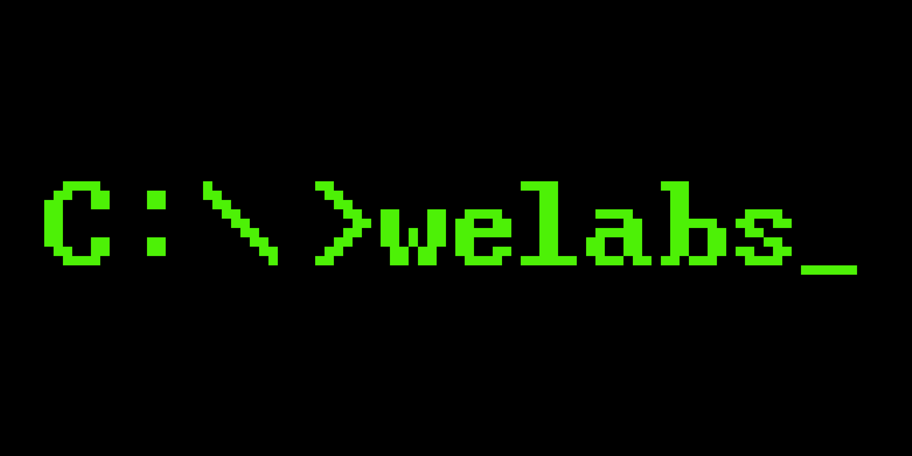
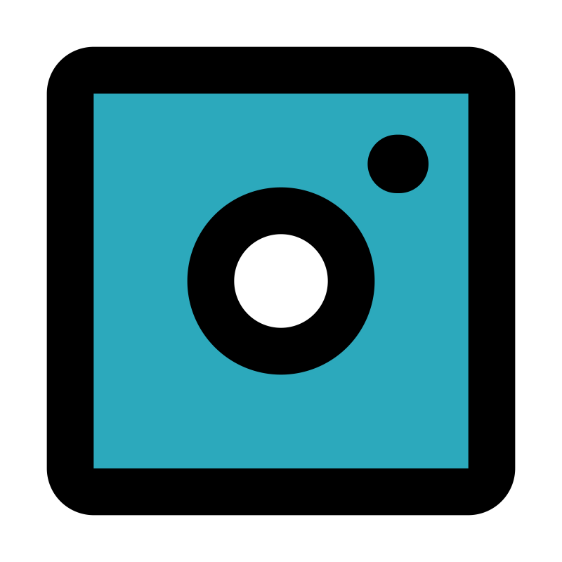

# Profile

Olá! Sou Wenderson, um estudante de programação e desenvolvimento de software apaixonado por tecnologia. Tenho conhecimentos sólidos em linguagens como C, C++, C#, Arduino, robótica e criação de jogos. Estou sempre em busca de aprimorar minhas habilidades e aprender novas tecnologias para me manter atualizado no mundo da programação.

A resolução de problemas é algo que me motiva, e adoro enfrentar desafios complexos. Acredito que a programação é uma forma de expressão artística, permitindo criar soluções inovadoras e impactar positivamente a vida das pessoas.

## Projetos/Aprendizado
👩‍💻 Trabalho atualmente no Projeto S.A.R.A

🧠 Estou aprendendo Desenvolvimento de Rede Neural

## HABILIDADES

Linguagens de Programação: C, C++, C#;
Frameworks e Bibliotecas: .NET, ASP.NET;
Bancos de Dados: MySQL, MongoDB;
Ferramentas de Controle de Versão: Git, GitHub

## Stack utilizada

**Desenvolvimento e Criação de Sofwares:** .NET Framework, MySQL, ASP.NET

<h3 aligh="left">About Me:</h3>

Olá! Sou Wenderson, um estudante de programação e desenvolvimento de software apaixonado por tecnologia. Tenho conhecimentos sólidos em linguagens como C, C++, C#, Arduino, robótica e criação de jogos. Estou sempre em busca de aprimorar minhas habilidades e aprender novas tecnologias para me manter atualizado no mundo da programação.

<h1 align="left"><strong> Alguns lugares que eu uso :3</h1>

<h2 align="left"><strong>MINHAS SKILLS:</h2>

